# Actividad no. 3 
### Andrea María Cabrera Rosito - 202010918
=====

# PARTE 1 - Gestion de Usuarios
- **Creación de usuarios llamados:**
 - *usuario1* 
 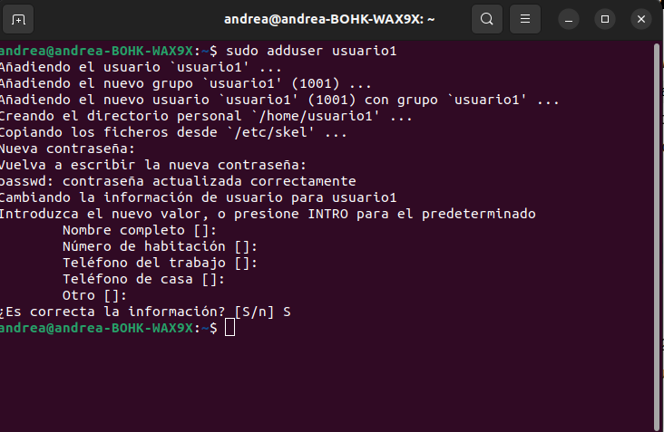
 - *usuario2* 
 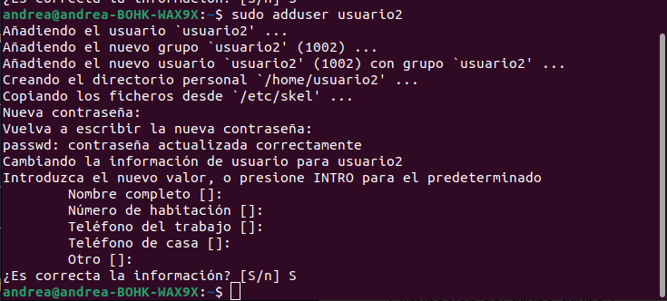
 - *usuario3*
 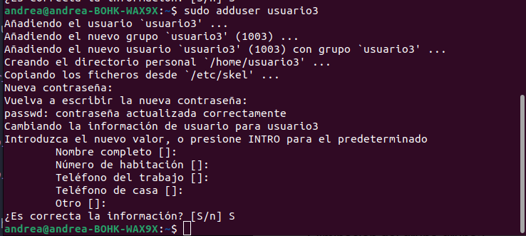

- **Establecimiento de nueva contraseña para cada usuario creado.**
    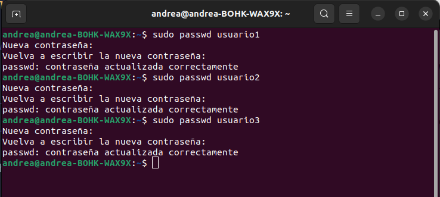
- **Mostrando la información del usuario *usuario1* usando el comando** `id`.
    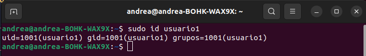
- **Eliminación del usuario, pero conserva su directorio principal.** *usuario3*.
    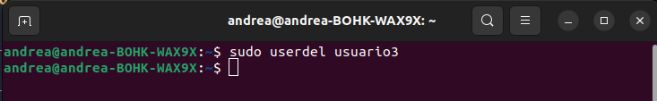
    > Nota: Para conservar el directorio principal **no** se agrega la flag `-r` al comando `userdel`.

# PARTE 2 - Gestion de Grupos
- **Creación de los grupos *grupo1* y *grupo2***.
 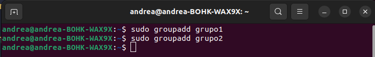

- **Agregando al usuario *usuario1* al grupo *grupo1* y *usuario2* al grupo *grupo2***.
 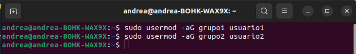
- **Verificando que los usuarios han sido agregados a los grupos con el comando `groups`**.
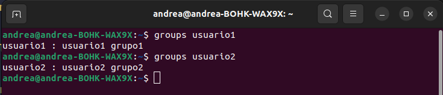
>Nota: El comando `groups` muestra los grupos a los que pertenece el usuario que lo ejecuta, por lo que se agregó el nombre del usuario a revisar. En este caso, *usuario1* y *usuario2*. Donde si se ve, que *usuario1* pertenece los grupos *grupo1*, *usuario1* y *usuario2* a los grupos *grupo2* y *usuario2* - los grupos denominados "usuarioX" donde "X" es el correlativo del mismo usuario, se crearon cuando los usuarios fueron creados.

- **Eliminación del grupo *grupo2***.
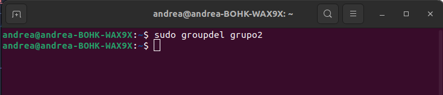

# PARTE 3 - Gestion de Permisos
- **Creación de Archivos y Directorios**
 - Como `usuario1`, crea un archivo llamado `archivo1.txt` en su directorio principal y escribe algo en él.
 

 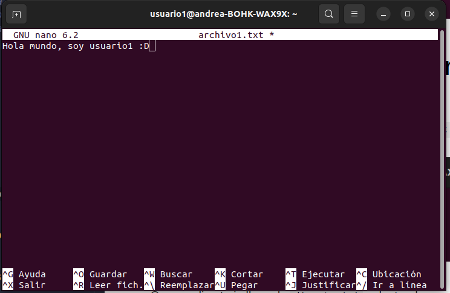
 >Mensaje escrito en archivo1.txt

 - Crea un directorio llamado `directorio1` y dentro de ese directorio, un archivo llamado `archivo2.txt`.
 

- **Verificar Permisos: Verifica los permisos del archivo y directorio usando el comando `ls -l` y `ls -ld` respectivamente**
 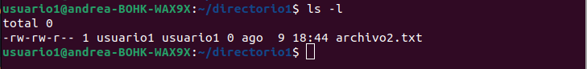
>ls -l

 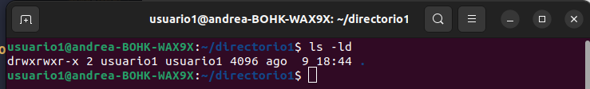
>ls -ld 
- **Modificar Permisos usando `chmod` con Modo Numérico: Cambia los permisos del `archivo1.txt` para que sólo `usuario1` pueda leer y escribir (permisos `rw-`), el grupo pueda leer (permisos `r--`) y nadie más pueda hacer nada.**
 6 = rw-  
 4 = r--  
 0 = ---  
 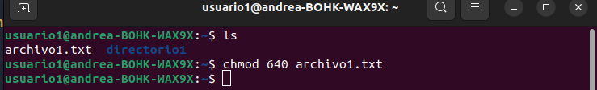

- **Modificar Permisos usando `chmod` con Modo Simbólico: Agrega permiso de ejecución al propietario del `archivo2.txt`.**
 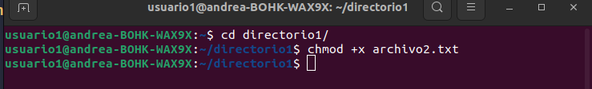

- **Cambiar el Grupo Propietario: Cambia el grupo propietario de `archivo2.txt` a `grupo1`.**
 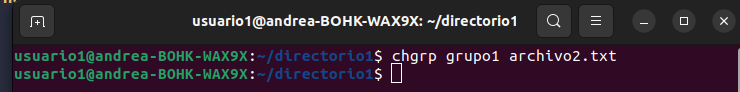

- **Configurar Permisos de Directorio: Cambia los permisos del `directorio1` para que sólo el propietario pueda entrar (permisos `rwx`), el grupo pueda listar contenidos pero no entrar (permisos `r--`), y otros no puedan hacer nada.**
 7 = rw-  
 4 = r--  
 0 = ---  
 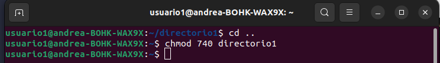

- **Comprobación de Acceso: Intenta acceder al `archivo1.txt` y `directorio1/archivo2.txt` como `usuario2`. Nota cómo el permiso de directorio afecta el acceso a los archivos dentro de él.**
 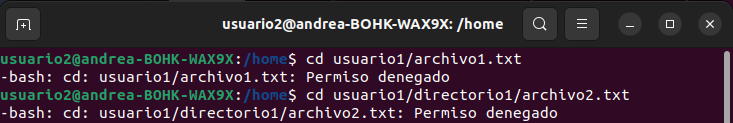

- **Verificación Final: Verifica los permisos y propietario de los archivos y directorio nuevamente con `ls -l` y `ls -ld`.**
 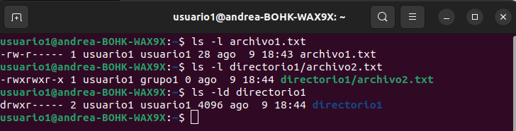