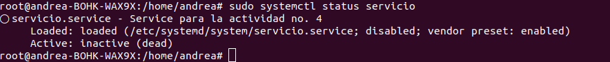
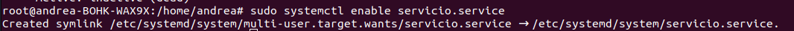

# Actividad no. 4
### Andrea María Cabrera Rosito - 202010918

Primeramente, se creó un script para que sea ejecutado por el servicio:

```bash
#!/bin/bash
while true; do
   ahora=$(date '+%Y-%m-%d %H:%M:%S') 
   echo "[202010918] - Hola mundo: $ahora" | systemd-cat -p info
   sleep 10
done
```

Para una mejor práctica, se movió el script a la carpeta `/usr/local/bin` y se le dio permisos de ejecución con:

```bash
sudo chmod +x /usr/local/bin/actividad4.sh
```

Se listaron los servicios para segurar que a nombrar el nuevo servicio que se creó no exista:

```bash 
systemctl list-unit-files --type=service | <nombre_a_poner>
```

Se creó un archivo .service en la carpeta `sercivio.service` con el siguiente contenido:

```
[Unit]
Description=Service para la actividad no. 4

[Service]
ExecStart=/usr/local/bin/actividad4.sh

[Install]
WantedBy=multi-user.target
```

Se le cambió los permisos con:

```bash
sudo chmod 640 /etc/systemd/system/sercivio.service
```

Se revisó el status del servicio con:

```bash
systemctl status sercivio.service
```
y se dio la siguiente salida:


Se activó el servicio con:

```bash
sudo systemctl enable sercivio.service
```
Que dio la siguiente salida:



y se actuvo el servicio con:

```bash
sudo systemctl start sercivio.service
```

y se revisó el status del servicio con:

```bash
systemctl status sercivio.service
```
y se dio la siguiente salida:


lo que nos indica que el servicio se está ejecutando correctamente.

